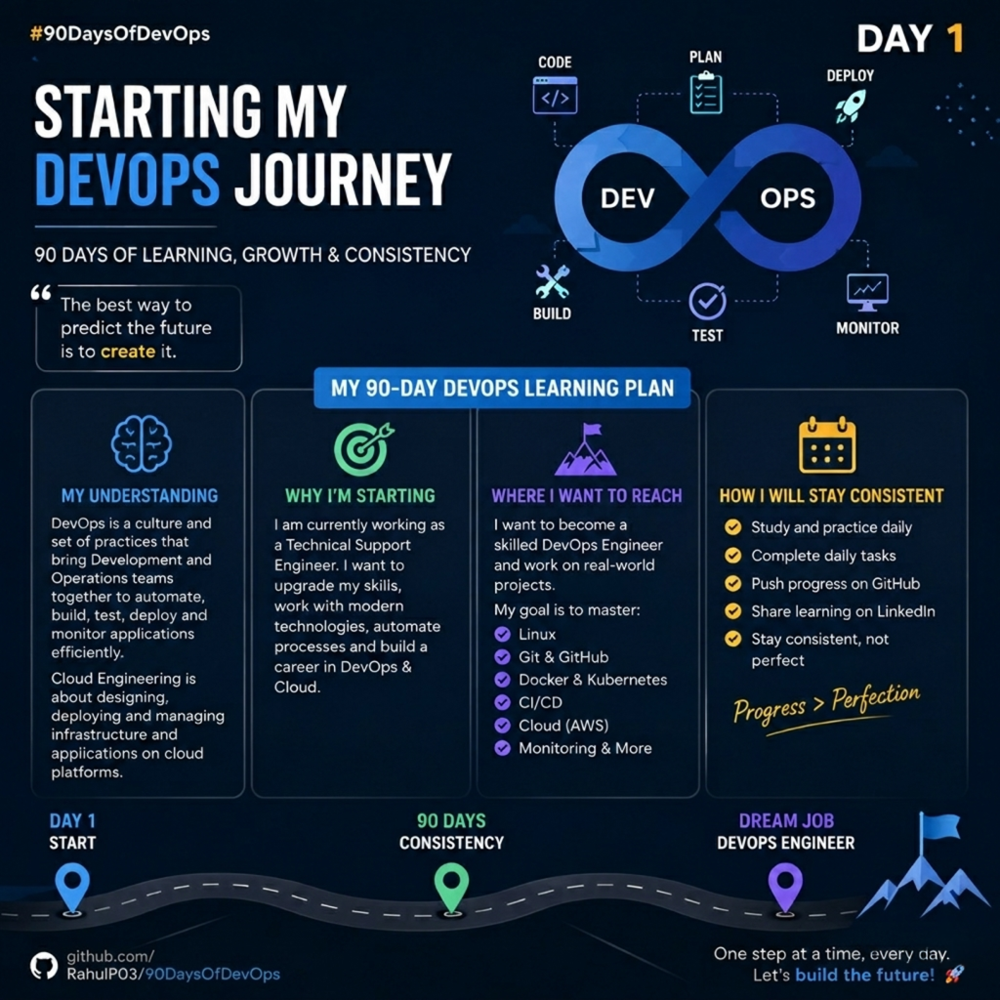

# Day 1 - Starting My #90DaysOfDevOps Journey 🚀

## What is my understanding of DevOps and Cloud Engineering?

DevOps is a culture and set of practices that helps development and operations teams work together efficiently. It focuses on automation, continuous integration, continuous delivery, monitoring, and faster software delivery.

Cloud Engineering is about building, deploying, and managing applications and infrastructure on cloud platforms like AWS, Azure, and Google Cloud.

---

## Why am I starting to learn DevOps & Cloud?

I am currently working as a Technical Support Engineer, and while working in support and troubleshooting, I developed a strong interest in DevOps, automation, and cloud technologies.

I want to improve my technical skills, understand modern infrastructure, and transition my career into the DevOps domain.

---

## Where do I want to reach?

My goal is to become a skilled DevOps Engineer with strong knowledge of:

- Linux
- Git & GitHub
- Networking
- Docker
- Kubernetes
- CI/CD
- Cloud platforms like AWS
- Automation & Monitoring tools

I also want to build real-world projects and become industry-ready.

---

## How will I stay consistent every single day?

- Study and practice daily
- Complete tasks step by step
- Push my progress regularly on GitHub
- Share learning publicly on LinkedIn
- Focus on consistency over perfection

---

Starting this journey with determination and consistency 💪

#90DaysOfDevOps #DevOps #Cloud #Linux #Student #LearnInPublic #CareerChange #DevopsKaJosh #TrainWithShubham

